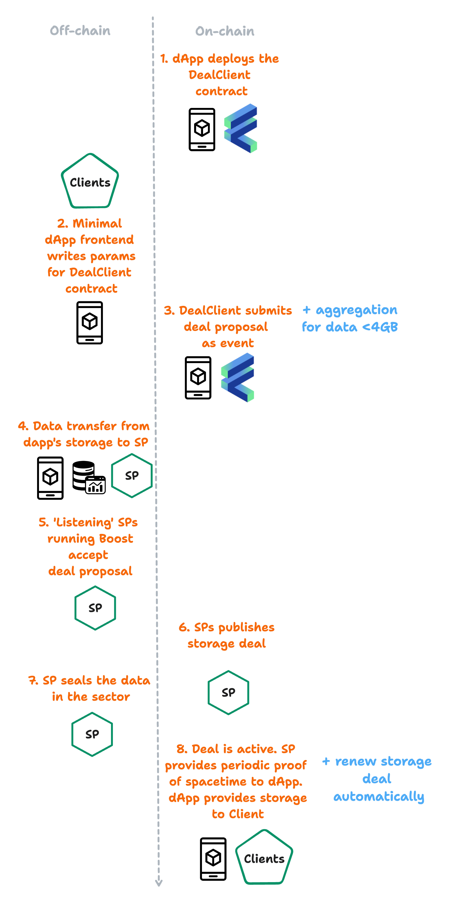

# Direct deal-making

There are services like deal aggregators that allow clients to create storage deals programmatically. However, aggregators are better suited to small-scale deals of under 4 GiB of total data. For those wishing to programmatically store larger blocks of data, _direct deal-making_ is a more suitable process.

## Steps

We're going to cover the basic steps of _direct deal-making_.

### Package the data

The client packages the data they want to store into a CAR file. They then upload this to a hosting intermediary service and generate a CID. [Storage on-ramp services](../../basics/how-storage-works/storage-onramps.md) are available to act as this intermediary.

### On-chain process

Using the CID and URL provided by the hosting service, the client can deploy the client contract and propose a storage deal.

Once the client contract is deployed, an event is emitted on-chain, and storage providers running [Boost](https://boost.filecoin.io/experimental-features/fvm-contract-deals) will receive the deal proposal.

### Storage providers

Each storage provider will decide whether to take the proposal and pick up the deal.

There are a variety of factors influencing whether or not a storage provider will accept the deal, including if there is a pre-existing relationship between the client and the storage provider, whether the deal is financially attractive to the storage provider if they can accommodate the size of the data, or whether clients have datacap.

If the storage provider accepts the deal through Boost, that provider will download the CAR file from the web server and publish the storage deal on-chain. A client can check that the deal was successfully published on the blockchain via [block explorers](../../networks/mainnet/explorers.md).

A storage deal published on-chain denotes the _intent_ for a storage provider to make a storage deal. But this _intent_ does not mean that the deal is _complete_. The deal is only complete once a storage provider has sealed the data into sectors and the deal ID is published on-chain.

#### Timelines

The timelines for the published storage deals and the deal ID confirmation are inherently undefined. Storage providers do not necessarily publish storage deals once they come in. Depending on the size of the data, the storage provider may wait until they have enough data from other deals to fill a sector.

Deals made on the Calibration testnet will be picked-up within 24 hours.

## Review

Here is a diagram showing each of these steps in turn:

## Next steps

For a complete tutorial on how to use the client contract to initiate a deal from FVM, see our [client contract tutorial](../developing-contracts/client-contract-tutorial.md). A full explanation of the client contract in the context of a direct deal-making starter kit can be found [here](https://github.com/filecoin-project/fvm-starter-kit-deal-making/tree/main).
